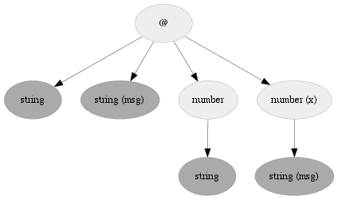

argcheck
========

A powerful function argument checker and function overloading system for
Lua or LuaJIT.

Argcheck generates specific code for checking arguments of a function. This
allows complex argument checking (possibly with optional values), with
little overhead (with [LuaJIT](http://luajit.org)). Argcheck computes a
tree of all possible variants of arguments, allowing efficient overloading
and default argument management.

Installation
------------

The easiest is to use [luarocks](http://www.luarocks.org).

If you use Torch, simply do
```sh
luarocks install argcheck
```
else
```sh
luarocks build https://raw.github.com/torch/argcheck/master/rocks/argcheck-scm-1.rockspec
```

You can also copy the `argcheck` directory where `luajit` (or `lua`) will
find it.

* * *

Note: argcheck requires a `bit` library. If you are not using `luajit` (you
are seriously encouraged to switch to it) nor lua 5.2 (which ships with
`bit32` library), please install first the `luabitop` library or `bitlib`:
```sh
luarocks install luabitop
```
* * *

Documentation
------------

To use `argcheck`, you have to first `require` it:
```lua
local argcheck = require 'argcheck'
```
In the following, we assume this has been done in your script.
Note that `argcheck` does not import anything globally, to avoid cluttering
the global namespace.  The value returned by the require is a function: for
most usages, it will be the only thing you need.

_Note that in the following examples we do not use local variables for
check functions or example functions. This is bad practive, but helpful if
you want to cut-and-paste the code in your interactive lua to see how
this is running._

The `argcheck()` function creates a fast pre-compiled function for checking
arguments, according to rules provided by the user. Assume you have a
function which requires a unique number argument:
```lua
function addfive(x)
  print(string.format('%f + 5 = %f', x, x+5))
end
```
You can make sure everything goes fine by doing creating the rule:
```lua
check = argcheck{
   {name="x", type="number"}
}

function addfive(...)
   local x = check(...)
   print(string.format('%f + 5 = %f', x, x+5))
end
```
If a user try to pass a wrong argument, too many arguments, or no arguments
at all, `argcheck` will complain:
```lua
arguments:
{
  x = number  -- 
}
   
stdin:2: invalid arguments
```

A rule must at least take a `name` field. The `type` field is optional
(even though it is highly recommended!). If `type` is not provided, `argcheck` will make
sure the given argument is not `nil`. If you want also to accept `nil` arguments, see the
[`opt` option](#argcheck.opt).

### Default arguments
Arguments can have defaults:
```lua
check = argcheck{
   {name="x", type="number", default=0}
}
```
In which case, if the argument is missing, `argcheck` will pass the default
one to your function:
```lua
> addfive()
0.000000 + 5 = 5.000000
```

### Help (or doc)
Argcheck encourages you to add help to your function. You can document each argument:
```lua
check = argcheck{
   {name="x", type="number", default=0, help="the age of the captain"}
}
```
Or even document the function:
```lua
check = argcheck{
   help=[[
This function is going to do a simple addition.
Give a number, it adds 5. Amazing.
]],
   {name="x", type="number", default=0, help="the age of the captain"}
}
```
Then, if the user makes a mistake in the arguments, the error message
becomes more clear:
```lua
> addfive('')
stdin:2: invalid arguments
                                                                                                     
This function is going to do a simple addition.                                                               
Give a number, it adds 5. Amazing.

arguments:
{
   [x = number]  -- the age of the captain [default=0]
}
```

Note that is (equivalently) possible to use the key `doc=` instead of `help=`.

### Multiple arguments

Until now, our function had only one argument. Obviously, argcheck can
handle as many as you wish:
```lua
check = argcheck{
   help=[[
This function is going to do a simple addition.
Give a number, it adds 5. Amazing.
]],
   {name="x", type="number", default=0, help="the age of the captain"},
   {name="msg", type="string", help="a message"}
}

function addfive(...)
  local x, msg = check(...)
  print(string.format('%f + 5 = %f', x, x+5))
  print(msg)
end
```
Argcheck handles well various cases, including those where some arguments
with defaults values might be missing:
```lua
> addfive(4, 'hello world')
4.000000 + 5 = 9.000000
hello world
>
> addfive('hello world')
0.000000 + 5 = 5.000000
hello world
>
> addfive(4)

stdin:2: invalid arguments
                                                                                                     
This function is going to do a simple addition.                                                               
Give a number, it adds 5. Amazing.                                                                            

arguments:
{
  [x   = number]  -- the age of the captain [default=0]
   msg = string   -- a message
}
```

### Default argument defaulting to another argument

Arguments can have a default value coming from another argument, with the
`defaulta` option. In the following
```lua

check = argcheck{
  {name="x", type="number"},
  {name="y", type="number", defaulta="x"}
}

function mul(...)
   local x, y = check(...)
   print(string.format('%f x %f = %f', x, y, x*y))
end
```
argument `y` will take the value of `x` if it is not passed during the function call:
```lua
> mul(3,4)
3.000000 x 4.000000 = 12.000000
> mul(3)
3.000000 x 3.000000 = 9.000000
```

### Default arguments function

In some more complex cases, sometimes one needs to run a particular function when
the given argument is not provided. The option `defaultf` is here to help.
```lua

idx = 0

check = argcheck{
   {name="x", type="number"},
   {name="y", type="number", defaultf=function() idx = idx + 1 return idx end}
}

function mul(...)
   local x, y = check(...)
   print(string.format('%f x %f = %f', x, y, x*y))
end
```

This will output the following:
```lua
> mul(3)
3.000000 x 1.000000 = 3.000000
> mul(3)
3.000000 x 2.000000 = 6.000000
> mul(3)
3.000000 x 3.000000 = 9.000000
```

<a name="argcheck.opt"/>
### Optional arguments

Arguments with a default value can be seen as optional. However, as they
do have a default value, the underlying function will never receive a `nil`
value. In some situations, one might need to declare an optional argument
with no default value. You can do this with the `opt` option.
```lua
check = argcheck{
  {name="x", type="number", default=0, help="the age of the captain"},
  {name="msg", type="string", help="a message", opt=true}
}

function addfive(...)
   local x, msg = check(...)
   print(string.format('%f + 5 = %f', x, x+5))
   print(msg)
end
```
In this example, one might call `addfive()` without the `msg` argument. Of
course, the underlying function must be able to handle `nil` values:
```lua
> addfive('hello world')
0.000000 + 5 = 5.000000
hello world
> addfive()
0.000000 + 5 = 5.000000
nil
```

### Specific per-rule check

It is possible to add an extra specific checking function for a given checking
rule, with the `check` option. This function will be called (with the corresponding argument)
in addition to the standard type checking. This can be useful for refined argument selection:
```lua
check = argcheck{
  {name="x", type="number", help="a number between one and ten",
    check=function(x)
            return x >= 1 and x <= 10
          end}
}

function addfive(...)
   local x = check(...)
   print(string.format('%f + 5 = %f', x, x+5))
end

> addfive(3)
3.000000 + 5 = 8.000000

> addfive(11)
stdin:2: invalid arguments

arguments:
{
   x = number  -- a number between one and ten
}
```

### Named arguments

Argcheck handles named argument calls. Following the previous example, both
```lua
addfive(1, "hello world")
```
and
```lua
addfive{x=1, msg="hello world"}
```
are valid. However, ordered arguments are handled in a *much faster* way
(especially with LuaJIT) than named arguments.

### Options global to all rules

Argcheck has several interesting global options, as the `help` (or `doc`) we have introduced already.
Those global options are simply set in the main `argcheck` table:
```lua
check = argcheck{
   help = "blah blah", -- global help option
...
}
```
Other global options are described in the following.

#### Pack arguments into a table

In some cases, it might be interesting to get all arguments into a
table. This is not recommended in general, as creating a table slows down
the checking process. However, when one was *a lot* of arguments, the
`pack` option might be of interest. The function created by `argcheck`
then returns a table containing all arguments with rule names as keys.
```lua
check = argcheck{
   pack=true,
   {name="x", type="number", default=0, help="the age of the captain"},
   {name="msg", type="string", help="a message"}
}

function addfive(...)
   local args = check(...) -- now arguments are stored in this table
   print(string.format('%f + 5 = %f', args.x, args.x+5))
   print(args.msg)
end

> addfive(5, 'hello world')
5.000000 + 5 = 10.000000
hello world
```

#### Restrict to named-only or ordered-only arguments

In some very special (rare) cases, one might want to disable named calls
like `addfive{x=1, msg='blah'}`, and stick to only ordered arguments like
`addfive(1, 'blah')`, or vice-versa. That might be to handle some ambiguous
calls, e.g. when one has to deal with table arguments. The options
`nonamed` and `noordered` can be used for that purpose:

```lua
check = argcheck{
   nonamed=true,
   {name="x", type="number", default=0, help="the age of the captain"},
   {name="msg", type="string", help="a message"}
}

function addfive(...)
   local x, msg = check(...)
   print(string.format('%f + 5 = %f', x, x+5))
   print(msg)
end

> addfive('blah')
0.000000 + 5 = 5.000000
blah

> addfive{msg='blah'}
stdin:2: invalid arguments

arguments:
{
   [x   = number]  -- the age of the captain [default=0]
   msg = string   -- a message
}
```

#### Quiet

If you want to handle errors yourself, you might want to make sure the
checking function is quiet. The `quiet=true` option is here for this. If
mentioned, the argument checker will return a boolean (`true` in case of
success, `false` if arguments do not match rules), followed by the
arguments (possibly packed). In case of failure `false` is followed by the
help message.

```lua
check = argcheck{
   quiet=true,
   {name="x", type="number", default=0, help="the age of the captain"},
   {name="msg", type="string", help="a message"}
}

> print(check(5, 'hello world'))
true             5      hello world

> print(check(5))
false   arguments:
{
  [x   = number]  -- the age of the captain [default=0]
   msg = string   -- a message
}
```

#### Function call

In case of success, the argument checker can call a function if
needed. Some users might find it more convenient than calling the argument
checker inside the function of interest. Taking back the first example, one
could use the `call` option and rewrite it as:
```lua
addfive = argcheck{
   {name="x", type="number"},

   call = function(x)
            print(string.format('%f + 5 = %f', x, x+5))
          end
}

> addfive(5)
5.000000 + 5 = 10.000000

> addfive()
stdin:1: arguments:
{
   x = number  --
}
```

#### Overloading

It is possible to overload previous created argchecks manually. E.g., in our example,
if we want `addfive()` to handle the case of a number or string argument,
one could leverage the `quiet` global option and do the following:
```lua
checknum = argcheck{
   quiet=true,
   {name="x", type="number"}
}

checkstr = argcheck{
   quiet=true,
   {name="str", type="string"}
}

function addfive(...)

  -- first case
  local status, x = checknum(...)
  if status then
    print(string.format('%f + 5 = %f', x, x+5))
    return
  end

  -- second case
  local status, str = checkstr(...)
  if status then
    print(string.format('%s .. 5 = %s', str, str .. '5'))
    return
  end

  -- note that in case of failure with quiet, the error is returned after the status
  print('usage:\n\n' .. x .. '\n\nor\n\n' .. str)
  error('invalid arguments')
end

> addfive(123)
5.000000 + 5 = 10.000000

> addfive('hi')
hi .. 5 = hi5

> addfive()
usage:

arguments:
{
   x = number  --
}

or

arguments:
{
   str = string  --
}
stdin:19: invalid arguments
```

This can however quickly become a burden, if there are many possible
argument variations. Instead, one can use the `overload` option, which is
supposed to be used together with `call`. The value provided to `overload`
must be a function previously created by `argcheck`.

If the arguments do not match any given variations, then the created
argument checker will show a global error message, with usage summarizing
all possibilites.

When overloading, `argcheck` will create a new function (for efficiency
reasons) including all possible cases which are being overloaded, as well
as the new given case. _Beware_ to overwrite the returned `argcheck`
function each time you overload one!

The previous example is then equivalent to:
```lua
addfive = argcheck{
  {name="x", type="number"},
  call = function(x) -- called in case of success
           print(string.format('%f + 5 = %f', x, x+5))
         end
}

addfive = argcheck{ -- overwrite it
  {name="str", type="string"},
  overload = addfive, -- overload the previous one
  call = function(str) -- called in case of success
           print(string.format('%s .. 5 = %s', str, str .. '5'))
         end
}

th> addfive(5)
5.000000 + 5 = 10.000000

th> addfive('hi')
hi .. 5 = hi5

th> addfive()
stdin:1: arguments:
{
   x = number  --
}

or

arguments:
{
   str = string  --
}
```

#### Force

`argcheck` hates ambiguities, and will spit out an error message if you try
to create some rules which are ambiguous. This can in fact happen easily
when overloading, or when mixing named/ordered arguments.

For example:
```lua
addfive = argcheck{
   {name="x", type="number"},
   call =
      function(x) -- called in case of success
         print(string.format('%f + 5 = %f', x, x+5))
      end
}

addfive = argcheck{
   {name="x", type="number"},
   {name="msg", type="string", default="i know what i am doing"},
   overload = addfive,
   call =
      function(x, msg) -- called in case of success
         print(string.format('%f + 5 = %f [msg = %s]', x, x+5, msg))
      end
}
```

will led to the error message "argcheck rules led to ambiguous
situations". One can override this behavior, with the `force` flag:
```lua
addfive = argcheck{
   {name="x", type="number"},
   {name="msg", type="string", default="i know what i am doing"},
   overload = addfive,
   force = true,
   call =
      function(x, msg) -- called in case of success
         print(string.format('%f + 5 = %f [msg = %s]', x, x+5, msg))
      end
}
```
In this case, consider the subsequent calls:
```lua
> addfive(5, 'hello')
5.000000 + 5 = 10.000000 [msg = hello]
> addfive(5)
5.000000 + 5 = 10.000000 [msg = i know what i am doing]
```
Note that the first function is then never called (you know what you are doing!).

#### Debug

Adding `debug=true` as global option will simply dump in stdout the
corresponding code for the given checking argument function. It will also
return a [dot graph](http://www.graphviz.org), for better understanding of
what is going on.

```lua
check, dotgraph = argcheck{
   debug=true,
   {name="x", type="number", default=0, help="the age of the captain"},
   {name="msg", type="string", help="a message"}
}

local arg01868630_1d
local istype
local graph
return function(...)
  local narg = select("#", ...)
  if narg >= 1 and istype(select(1, ...), "string") then
     if narg == 1 then
        local arg1 = arg01868630_1d
        local arg2 = select(1, ...)
        return arg1, arg2
     end
  end
  if narg >= 1 and istype(select(1, ...), "number") then
     if narg >= 2 and istype(select(2, ...), "string") then
        if narg == 2 then
           local arg1 = select(1, ...)
           local arg2 = select(2, ...)
           return arg1, arg2
        end
     end
  end
  if narg == 1 and istype(select(1, ...), "table") then
     local args = select(1, ...)
     local narg = 0
     for k,v in pairs(args) do
        narg = narg + 1
     end
     if narg >= 1 and istype(args.msg, "string") then
        if narg == 1 then
           local arg1 = arg01868630_1d
           local arg2 = args.msg
           return arg1, arg2
        end
     end
     if narg >= 1 and istype(args.x, "number") then
        if narg >= 2 and istype(args.msg, "string") then
           if narg == 2 then
              local arg1 = args.x
              local arg2 = args.msg
              return arg1, arg2
           end
        end
     end
  end
  assert(graph)
  error(string.format("%s\ninvalid arguments!", graph:usage()))
end

> print(dotgraph)
digraph ACN {
edge [penwidth=.3 arrowsize=0.8];
id0dcfe350 [label="@" penwidth=.1 fontsize=10 style=filled fillcolor="#eeeeee"];
edge [penwidth=.3 arrowsize=0.8];
id0dcfd8d8 [label="string" penwidth=.1 fontsize=10 style=filled fillcolor="#aaaaaa"];
id0dcfe350 -> id0dcfd8d8;
edge [penwidth=.3 arrowsize=0.8];
id0dcfdb50 [label="string (msg)" penwidth=.1 fontsize=10 style=filled fillcolor="#aaaaaa"];
id0dcfe350 -> id0dcfdb50;
edge [penwidth=.3 arrowsize=0.8];
id0dcfddb0 [label="number" penwidth=.1 fontsize=10 style=filled fillcolor="#eeeeee"];
edge [penwidth=.3 arrowsize=0.8];
id0dcfd9c0 [label="string" penwidth=.1 fontsize=10 style=filled fillcolor="#aaaaaa"];
id0dcfddb0 -> id0dcfd9c0;
id0dcfe350 -> id0dcfddb0;
edge [penwidth=.3 arrowsize=0.8];
id0dcfe978 [label="number (x)" penwidth=.1 fontsize=10 style=filled fillcolor="#eeeeee"];
edge [penwidth=.3 arrowsize=0.8];
id0dcfeb68 [label="string (msg)" penwidth=.1 fontsize=10 style=filled fillcolor="#aaaaaa"];
id0dcfe978 -> id0dcfeb68;
id0dcfe350 -> id0dcfe978;
}
```

As you can see, for a simple example like this one, the code is already not
that trivial, but handles both named and ordered arguments. Generating an
image out of the graph with dot (e.g. with `dot -Tpng`), leads to the
following:



Nodes with `(...)` are nodes corresponding to named arguments.

### Advanced usage

By default, `argcheck` uses the standard `type()` Lua function to determine the type of your
arguments. In some cases, like if you are handling your own class system, you might want to
specify how to check types. This can be simply done by overriding the `istype()` function
available in the `argcheck` environment.
```lua
env = require 'argcheck.env' -- retrieve argcheck environement

-- this is the default type function
-- which can be overrided by the user
function env.istype(obj, typename)
   return type(obj) == typename
end
```
Note that if you change the `istype()` function, it will *not* affect previously defined
argument checking functions: `istype()` is passed as an upvalue for each created argument
function.
